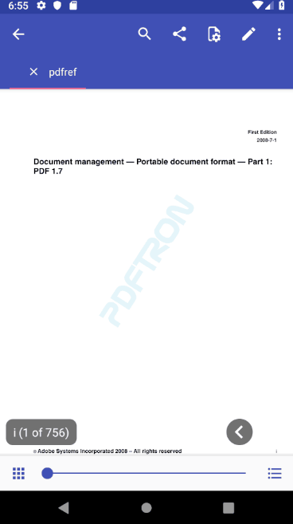
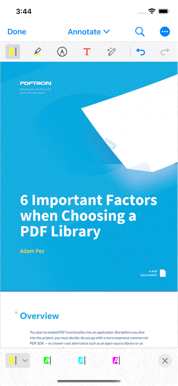

# PDFTron Flutter Wrapper

- [Prerequisites](#Prerequisites)
- [Preview](#preview)
- [Installation](#installation)
- [Usage](#usage)
- [APIs](#apis)
- [License](#license)

## Prerequisites
- A valid evaluation or commercial license key. If you do not have a license key, please contact sales for a commercial license key or click [here](https://www.pdftron.com/documentation/android/guides/flutter/?showkey=true) to get an evaluation key.
- PDFTron SDK >= 6.9.0
- Flutter >= 1.0.0

## Preview

**Android** |  **iOS**
:--:|:--:
 | 

## Installation

The complete installation and API guides can be found at https://www.pdftron.com/documentation/android/guides/flutter

### Android
1. First follow the Flutter getting started guides to [install](https://flutter.io/docs/get-started/install), [set up an editor](https://flutter.io/docs/get-started/editor), and [create a Flutter Project](https://flutter.io/docs/get-started/test-drive?tab=terminal#create-app). The rest of this guide assumes your project is created by running `flutter create myapp`.
2. Add the following dependency to your Flutter project in `myapp/pubspec.yaml`:
	```diff
	dependencies:
	   flutter:
	     sdk: flutter
	+  pdftron_flutter:
	+    git:
	+      url: git://github.com/PDFTron/pdftron-flutter.git
	+  permission_handler: '3.0.1'

	```
3. Now add the following items in your `myapp/android/app/build.gradle` file:
	```diff
	android {
	-   compileSdkVersion 27
	+   compileSdkVersion 28

	    lintOptions {
		disable 'InvalidPackage'
	    }

	    defaultConfig {
		applicationId "com.example.myapp"
	-       minSdkVersion 16
	+       minSdkVersion 21
	-       targetSdkVersion 27
	+       targetSdkVersion 28
	+       multiDexEnabled true
		versionCode flutterVersionCode.toInteger()
		versionName flutterVersionName
		testInstrumentationRunner "android.support.test.runner.AndroidJUnitRunner"
	    }

	+   configurations.all {
	+       resolutionStrategy.force "com.android.support:appcompat-v7:28.0.0"
	+       resolutionStrategy.force "com.android.support:support-v4:28.0.0"
	+       resolutionStrategy.force "android.arch.lifecycle:runtime:1.0.3"
	+   }
		...
	}
	```
4. In your `myapp\android\app\src\main\AndroidManifest.xml` file, add the following lines to the `<application>` tag:
	```diff
	...
	<application
		android:name="io.flutter.app.FlutterApplication"
		android:label="myapp"
		android:icon="@mipmap/ic_launcher"
	+	android:largeHeap="true"
	+	android:usesCleartextTraffic="true">
	  ...
	```
	Additionally, add the required permissions for your app in the `<manifest>` tag:
	```diff
		...
		<uses-permission android:name="android.permission.INTERNET" />
		<!-- Required to read and write documents from device storage -->
	+	<uses-permission android:name="android.permission.WRITE_EXTERNAL_STORAGE" />
		<!-- Required if you want to record audio annotations -->
	+	<uses-permission android:name="android.permission.RECORD_AUDIO" />
		...
	```

5. Replace `lib/main.dart` with what is shown [here](#usage)
6. Check that your Android device is running by running the command `flutter devices`. If none are available, follow the device set up instructions in the [Install](https://flutter.io/docs/get-started/install) guides for your platform.
7. Run the app with the command `flutter run`.

### iOS

1. First, follow the official getting started guide on [installation](https://flutter.io/docs/get-started/install/macos), [setting up an editor](https://flutter.io/docs/get-started/editor), and [create a Flutter project](https://flutter.io/docs/get-started/test-drive?tab=terminal#create-app), the following steps will assume your app is created through `flutter create myapp`

2. Open `myapp` folder in a text editor. Then open `myapp/pubspec.yaml` file, add:
	```diff
	dependencies:
	   flutter:
	     sdk: flutter
	+  pdftron_flutter:
	+    git:
	+      url: git://github.com/PDFTron/pdftron-flutter.git
	+  permission_handler: '3.0.1'
	```

3. Run `flutter packages get`
4. Open `myapp/ios/Podfile`, add:
	```diff
	 # Uncomment this line to define a global platform for your project
	-# platform :ios, '9.0'
	+platform :ios, '9.3'
	...
	 target 'Runner' do
	   ...
	+  # PDFTron Pods
	+  use_frameworks!
	+  pod 'PDFNet', podspec: 'POD_LINK_GOES_HERE'
	 end
	```
6. Run `flutter build ios --no-codesign` to ensure integration process is sucessful
7. Replace `lib/main.dart` with what is shown [here](#usage)
8. Run `flutter emulators --launch apple_ios_simulator`
9. Run `flutter run`

## Usage

Open `lib/main.dart`, replace the entire file with the following:

**Replace `your_pdftron_license_key` string with your license key**

```dart
import 'dart:async';
import 'dart:io' show Platform;

import 'package:flutter/material.dart';
import 'package:flutter/services.dart';
import 'package:pdftron_flutter/pdftron_flutter.dart';
import 'package:permission_handler/permission_handler.dart';

void main() => runApp(MyApp());

class MyApp extends StatefulWidget {
  @override
  _MyAppState createState() => _MyAppState();
}

class _MyAppState extends State<MyApp> {
  String _version = 'Unknown';
  String _document = "https://pdftron.s3.amazonaws.com/downloads/pdfref.pdf";

  @override
  void initState() {
    super.initState();
    initPlatformState();

    if (Platform.isIOS) {
      // Open the document for iOS, no need for permission
      showViewer();

    } else {
      // Request for permissions for android before opening document
      launchWithPermission();
    }
  }

  Future<void> launchWithPermission() async {
    Map<PermissionGroup, PermissionStatus> permissions = await PermissionHandler().requestPermissions([PermissionGroup.storage]);
    if (granted(permissions[PermissionGroup.storage])) {
      showViewer();
    }
  }

  // Platform messages are asynchronous, so we initialize in an async method.
  Future<void> initPlatformState() async {
    String version;
    // Platform messages may fail, so we use a try/catch PlatformException.
    try {
      PdftronFlutter.initialize("your_pdftron_license_key");
      version = await PdftronFlutter.version;
    } on PlatformException {
      version = 'Failed to get platform version.';
    }

    // If the widget was removed from the tree while the asynchronous platform
    // message was in flight, we want to discard the reply rather than calling
    // setState to update our non-existent appearance.
    if (!mounted) return;

    setState(() {
      _version = version;
    });
  }


  void showViewer() {
    // Shows how to disable functionality. Uncomment to configure your viewer with a Config object.
    //  var disabledElements = [Buttons.shareButton, Buttons.searchButton];
    //  var disabledTools = [Tools.annotationCreateLine, Tools.annotationCreateRectangle];
    //  var config = Config();
    //  config.disabledElements = disabledElements;
    //  config.disabledTools = disabledTools;
    //  PdftronFlutter.openDocument(_document, config: config);

    // Open document without a config file which will have all functionality enabled.
    PdftronFlutter.openDocument(_document);
  }

  bool granted(PermissionStatus status) {
    return status == PermissionStatus.granted;
  }

  @override
  Widget build(BuildContext context) {
    return MaterialApp(
      home: Scaffold(
        appBar: AppBar(
          title: const Text('PDFTron flutter app'),
        ),
        body: Center(
          child: Text('Running on: $_version\n'),
        ),
      ),
    );
  }
}
```

## APIs

- `PdftronFlutter.version`

Obtain PDFTron SDK version

- `PdftronFlutter.initialize(String)`

Initializes PDFTron SDK

- `PdftronFlutter.openDocument(String)`

Opens a document in the viewer

- `PdftronFlutter.openDocument(String, Config)`

Opens a document in the viewer with options to remove buttons and disable tools

```dart
var disabledElements = [Buttons.shareButton, Buttons.searchButton];
var disabledTools = [Tools.annotationCreateLine, Tools.annotationCreateRectangle];
var config = Config();
config.disabledElements = disabledElements;
config.disabledTools = disabledTools;
PdftronFlutter.openDocument(_document, config: config);
```

## Contributing
See [Contributing](./CONTRIBUTING.md)

## License
See [License](./LICENSE)
