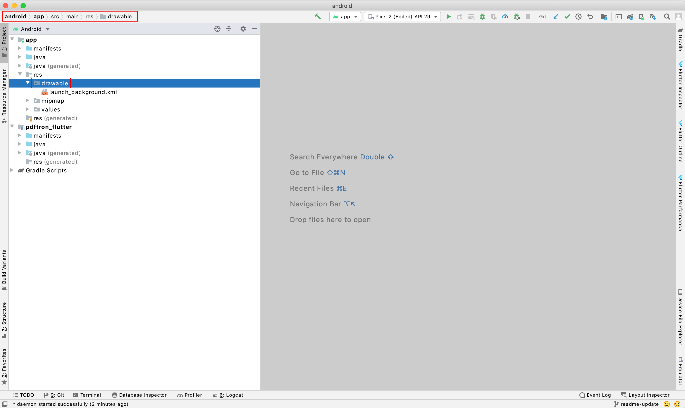
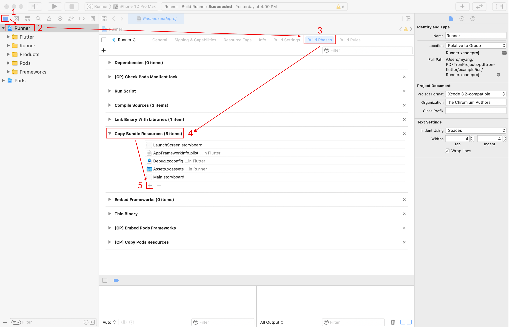

# PDFTron Flutter Wrapper

- [Prerequisites](#Prerequisites)
- [Preview](#preview)
- [Installation](#installation)
- [Usage](#usage)
- [APIs](#apis)
- [License](#license)

## Prerequisites
- No license key is requird for trial. However, a valid commercial license key is required after trial.
- PDFTron SDK >= 6.9.0
- Flutter >= 1.0.0

## Preview

**Android** |  **iOS**
:--:|:--:
 | 

## Legacy UI

Version `0.0.6` is the last stable release for the legacy UI.

The release can be found here: https://github.com/PDFTron/pdftron-flutter/releases/tag/legacy-ui.

## Installation

The complete installation and API guides can be found at https://www.pdftron.com/documentation/android/flutter

### Android
1. First follow the Flutter getting started guides to [install](https://flutter.io/docs/get-started/install), [set up an editor](https://flutter.io/docs/get-started/editor), and [create a Flutter Project](https://flutter.io/docs/get-started/test-drive?tab=terminal#create-app). The rest of this guide assumes your project is created by running `flutter create myapp`.
2. Add the following dependency to your Flutter project in `myapp/pubspec.yaml`:
	```diff
	dependencies:
	   flutter:
	     sdk: flutter
	+  pdftron_flutter:
	+    git:
	+      url: git://github.com/PDFTron/pdftron-flutter.git
	+  permission_handler: '3.0.1'

	```
3. Now add the following items in your `myapp/android/app/build.gradle` file:
	```diff
	android {
	    compileSdkVersion 29

	    lintOptions {
		disable 'InvalidPackage'
	    }

	    defaultConfig {
		applicationId "com.example.myapp"
	-       minSdkVersion 16
	+       minSdkVersion 21
		targetSdkVersion 29
	+       multiDexEnabled true
	+       manifestPlaceholders = [pdftronLicenseKey:PDFTRON_LICENSE_KEY]
		versionCode flutterVersionCode.toInteger()
		versionName flutterVersionName
		testInstrumentationRunner "androidx.test.runner.AndroidJUnitRunner"
	    }
		...
	}
	```

4. In your `myapp/android/gradle.properties` file. Add the following line to it:
    ``` diff
    # Add the PDFTRON_LICENSE_KEY variable here. 
    # For trial purposes leave it blank.
    # For production add a valid commercial license key.
    PDFTRON_LICENSE_KEY=
    ```
    
5. In your `myapp\android\app\src\main\AndroidManifest.xml` file, add the following lines to the `<application>` tag:
	```diff
	...
	<application
		android:name="io.flutter.app.FlutterApplication"
		android:label="myapp"
		android:icon="@mipmap/ic_launcher"
	+	android:largeHeap="true"
	+	android:usesCleartextTraffic="true">
	
	    	<!-- Add license key in meta-data tag here. This should be inside the application tag. -->
	+	<meta-data
	+		android:name="pdftron_license_key"
	+		android:value="${pdftronLicenseKey}"/>
	...
	```
	
	Additionally, add the required permissions for your app in the `<manifest>` tag:
	```diff
		...
	+	<uses-permission android:name="android.permission.INTERNET" />
		<!-- Required to read and write documents from device storage -->
	+	<uses-permission android:name="android.permission.WRITE_EXTERNAL_STORAGE" />
		<!-- Required if you want to record audio annotations -->
	+	<uses-permission android:name="android.permission.RECORD_AUDIO" />
		...
	```

5a. (If using `DocumentView` widget) In your `MainActivity` file (either kotlin or java), change the parent class to `FlutterFragmentActivity`:
```
import androidx.annotation.NonNull
import io.flutter.embedding.android.FlutterFragmentActivity
import io.flutter.embedding.engine.FlutterEngine
import io.flutter.plugins.GeneratedPluginRegistrant

class MainActivity : FlutterFragmentActivity() {
    override fun configureFlutterEngine(@NonNull flutterEngine: FlutterEngine) {
        GeneratedPluginRegistrant.registerWith(flutterEngine);
    }
}
```

6. Replace `lib/main.dart` with what is shown [here](#usage)
7. Check that your Android device is running by running the command `flutter devices`. If none are available, follow the device set up instructions in the [Install](https://flutter.io/docs/get-started/install) guides for your platform.
8. Run the app with the command `flutter run`.

### iOS

1. First, follow the official getting started guide on [installation](https://flutter.io/docs/get-started/install/macos), [setting up an editor](https://flutter.io/docs/get-started/editor), and [create a Flutter project](https://flutter.io/docs/get-started/test-drive?tab=terminal#create-app), the following steps will assume your app is created through `flutter create myapp`

2. Open `myapp` folder in a text editor. Then open `myapp/pubspec.yaml` file, add:
	```diff
	dependencies:
	   flutter:
	     sdk: flutter
	+  pdftron_flutter:
	+    git:
	+      url: git://github.com/PDFTron/pdftron-flutter.git
	+  permission_handler: '3.0.1'
	```

3. Run `flutter packages get`
4. Open `myapp/ios/Podfile`, add:
	```diff
	 # Uncomment this line to define a global platform for your project
	-# platform :ios, '9.0'
	+platform :ios, '10.0'
	...
	 target 'Runner' do
	   ...
	+  # PDFTron Pods
	+  use_frameworks!
	+  pod 'PDFNet', podspec: 'https://www.pdftron.com/downloads/ios/cocoapods/pdfnet/latest.podspec'
	 end
	```
6. Run `flutter build ios --no-codesign` to ensure integration process is sucessful
7. Replace `lib/main.dart` with what is shown [here](#usage)
8. Run `flutter emulators --launch apple_ios_simulator`
9. Run `flutter run`

## Usage

Open `lib/main.dart`, replace the entire file with the following:

```dart
import 'dart:async';
import 'dart:io' show Platform;

import 'package:flutter/material.dart';
import 'package:flutter/services.dart';
import 'package:pdftron_flutter/pdftron_flutter.dart';
import 'package:permission_handler/permission_handler.dart';

void main() => runApp(MyApp());

class MyApp extends StatelessWidget {
  @override
  Widget build(BuildContext context) {
    return MaterialApp(
      home: Viewer(),
    );
  }
}

class Viewer extends StatefulWidget {
  @override
  _ViewerState createState() => _ViewerState();
}

class _ViewerState extends State<Viewer> {
  String _version = 'Unknown';
  String _document =
      "https://pdftron.s3.amazonaws.com/downloads/pl/PDFTRON_mobile_about.pdf";
  bool _showViewer = true;

  @override
  void initState() {
    super.initState();
    initPlatformState();

    if (Platform.isIOS) {
      // Open the document for iOS, no need for permission
      showViewer();
    } else {
      // Request for permissions for android before opening document
      launchWithPermission();
    }
  }

  Future<void> launchWithPermission() async {
    Map<PermissionGroup, PermissionStatus> permissions =
        await PermissionHandler().requestPermissions([PermissionGroup.storage]);
    if (granted(permissions[PermissionGroup.storage])) {
      showViewer();
    }
  }

  bool granted(PermissionStatus status) {
    return status == PermissionStatus.granted;
  }

  // Platform messages are asynchronous, so we initialize in an async method.
  Future<void> initPlatformState() async {
    String version;
    // Platform messages may fail, so we use a try/catch PlatformException.
    try {
      PdftronFlutter.initialize("your_pdftron_license_key");
      version = await PdftronFlutter.version;
    } on PlatformException {
      version = 'Failed to get platform version.';
    }

    // If the widget was removed from the tree while the asynchronous platform
    // message was in flight, we want to discard the reply rather than calling
    // setState to update our non-existent appearance.
    if (!mounted) return;

    setState(() {
      _version = version;
    });
  }

  void showViewer() async {
    // opening without a config file will have all functionality enabled.
    // await PdftronFlutter.openDocument(_document);

    // shows how to disale functionality
//      var disabledElements = [Buttons.shareButton, Buttons.searchButton];
//      var disabledTools = [Tools.annotationCreateLine, Tools.annotationCreateRectangle];
    var config = Config();
//      config.disabledElements = disabledElements;
//      config.disabledTools = disabledTools;
//      config.multiTabEnabled = true;
//      config.customHeaders = {'headerName': 'headerValue'};

    var documentLoadedCancel = startDocumentLoadedListener((filePath) {
      print("document loaded: $filePath");
    });

    await PdftronFlutter.openDocument(_document, config: config);

    try {
      PdftronFlutter.importAnnotationCommand(
          "<?xml version=\"1.0\" encoding=\"UTF-8\"?>\n" +
              "    <xfdf xmlns=\"http://ns.adobe.com/xfdf/\" xml:space=\"preserve\">\n" +
              "      <add>\n" +
              "        <square style=\"solid\" width=\"5\" color=\"#E44234\" opacity=\"1\" creationdate=\"D:20200619203211Z\" flags=\"print\" date=\"D:20200619203211Z\" name=\"c684da06-12d2-4ccd-9361-0a1bf2e089e3\" page=\"1\" rect=\"113.312,277.056,235.43,350.173\" title=\"\" />\n" +
              "      </add>\n" +
              "      <modify />\n" +
              "      <delete />\n" +
              "      <pdf-info import-version=\"3\" version=\"2\" xmlns=\"http://www.pdftron.com/pdfinfo\" />\n" +
              "    </xfdf>");
    } on PlatformException catch (e) {
      print("Failed to importAnnotationCommand '${e.message}'.");
    }

    try {
      PdftronFlutter.importBookmarkJson('{"0":"Page 1"}');
    } on PlatformException catch (e) {
      print("Failed to importBookmarkJson '${e.message}'.");
    }

    var annotCancel = startExportAnnotationCommandListener((xfdfCommand) {
      // local annotation changed
      // upload XFDF command to server here
      print("flutter xfdfCommand: $xfdfCommand");
    });

    var bookmarkCancel = startExportBookmarkListener((bookmarkJson) {
      print("flutter bookmark: $bookmarkJson");
    });

    var path = await PdftronFlutter.saveDocument();
    print("flutter save: $path");

    // to cancel event:
    // annotCancel();
    // bookmarkCancel();
  }

  @override
  Widget build(BuildContext context) {
    return Scaffold(
      body: Container(
        width: double.infinity,
        height: double.infinity,
        child:
            // Uncomment this to use Widget version of the viewer
            // _showViewer
            // ? DocumentView(
            //     onCreated: _onDocumentViewCreated,
            //   ):
            Container(),
      ),
    );
  }

  void _onDocumentViewCreated(DocumentViewController controller) async {
    Config config = new Config();

    var leadingNavCancel = startLeadingNavButtonPressedListener(() {
      // Uncomment this to quit the viewer when leading navigation button is pressed
      // this.setState(() {
      //   _showViewer = !_showViewer;
      // });

      // Show a dialog when leading navigation button is pressed
      _showMyDialog();
    });

    controller.openDocument(_document, config: config);
  }

  Future<void> _showMyDialog() async {
    print('hello');
    return showDialog<void>(
      context: context,
      barrierDismissible: false, // user must tap button!
      builder: (BuildContext context) {
        return AlertDialog(
          title: Text('AlertDialog'),
          content: SingleChildScrollView(
            child: Text('Leading navigation button has been pressed.'),
          ),
          actions: <Widget>[
            TextButton(
              child: Text('OK'),
              onPressed: () {
                Navigator.of(context).pop();
              },
            ),
          ],
        );
      },
    );
  }
}
```

## Function APIs

### Note 

For APIs that states "**PdftronFlutter only**", these would only be callable in a plugin fashion. Below is an example for [initialize](#PdftronFlutter.initialize);

```dart
PdftronFlutter.initialize('your_license_key');
```

But for those that are not specified, these would be callable in both plugin and widget versions. For example, openDocument is accessible in 2 ways:

Plugin:
```dart
void showViewer() async {
  PdftronFlutter.openDocument('https://pdftron.s3.amazonaws.com/downloads/pl/PDFTRON_about.pdf');
}
```

Widget (DocumentViewController):
```dart
void _onDocumentViewCreated(DocumentViewController controller) {
    controller.openDocument('https://pdftron.s3.amazonaws.com/downloads/pl/PDFTRON_about.pdf');
}
```

We suggest that you stick with either version for the APIs that are callable in both versions, to avoid unnecessary problems.

There are several custom classes used in these APIs: `Annot`, `AnnotWithRect`, `Field`, `Rect`, `AnnotFlag`,`AnnotWithFlag` and `CustomToolbar`. These classes together with constants that are used in the examples below are all listed [here](./lib/options.dart).

### version

Obtains PDFTron SDK version. **PdftronFlutter only**.

```dart
String version = PdftronFlutter.version;
print('Current PDFTron SDK version is: ' + version);
```

### platformVersion

Obtains the current platform version. **PdftronFlutter only**.

```dart
String platformVersion = PdftronFlutter.platformVersion;
print('App is currently running on: ' + platformVersion);
```

### initialize

Initializes PDFTron SDK with your PDFTron commercial license key. You can run PDFTron in demo mode by passing an empty string. **PdftronFlutter only**.

Parameters:

Name | Type | Required | Description
--- | --- | --- | ---
key | String | true | your PDFTron license key

Returns a Future.

```dart
PdftronFlutter.initialize('your_licensey_key');
```

### openDocument

Opens a document in the viewer with options to remove buttons and disable tools.

Parameters:

Name | Type | Required | Description
--- | --- | --- | ---
document | String | true | path to the document
password | String | false | password to an encrypted document
config | Config | false | viewer configuration options

Returns a Future that would resolve when document is loaded.

For configs (more info could be found [here](./lib/config.dart)):

#### disabledElements
array of [Buttons](./lib/config.dart) constants, defaults to none.

Defines buttons to be disabled for the viewer.

```dart
var disabledElements = [Buttons.shareButton, Buttons.searchButton];
config.disabledElements = disabledElements;
```

#### disabledTools
array of [Tools](./lib/config.dart) constants, defaults to none.

Defines tools to be disabled for the viewer.

```dart
var disabledTools = [Tools.annotationCreateLine, Tools.annotationCreateRectangle];
config.disabledTools = disabledTools;
```

#### multiTabEnabled
bool, defaults to false.

Defines whether viewer will use tabs in order to have more than one document open simultaneously (like a web browser). Calling [openDocument](#openDocument) with this value being true will cause a new tab to be opened with the associated document.

```dart
config.multiTabEnabled = true;
```

#### customerHeaders
map<string, string>, defaults to empty.

Defines custom headers to use with HTTP/HTTPS requests.

```dart
config.customHeaders = {'headerName': 'headerValue'};
```

#### annotationToolbars
array of [`CustomToolbar`](./lib/config.dart) objects or [`DefaultToolbars`](./lib/config.dart) constants.

Defines custom toolbars. If passed in, the set of default toolbars will no longer appear. It is possible to mix and match with default toolbars. See example below:

```dart
// Viewer will use a custom defined toolbar and a default annotate toolbar in this case
var customToolbar = new CustomToolbar('myToolbar', 'myToolbar', [Tools.annotationCreateArrow, Tools.annotationCreateCallout], ToolbarIcons.favorite);
var annotationToolbars = [DefaultToolbars.annotate, customToolbar];
```

#### hideDefaultAnnotationToolbars
array of [`DefaultToolbars`](./lib/config.dart) constants, defaults to none.

Defines which default annotation toolbars should be hidden. Note that this should be used when [annotationToolbars](#annotationToolbars) is not defined.

```dart
// Viewer will use all the default toolbars except annotate or draw in this case
var hideDefaultAnnotationToolbars = [DefaultToolbars.annotate, DefaultToolbars.draw];
config.hideDefaultAnnotationToolbars = hideDefaultAnnotationToolbars;
```

#### hideAnnotationToolbarSwitcher
bool, defaults to false.

Defines whether to show the toolbar switcher in the top toolbar.

```dart
config.hideAnnotationToolbarSwitcher = true;
```

#### hideTopToolbars
bool, defaults to false.

Defines whether to hide both the top app nav bar and the annotation toolbar.

```dart
config.hideTopToolbars = true;
```

#### hideTopAppNavBar
bool, defaults to false.

Defines whether to hide the top navigation app bar.

```dart
config.hideTopAppNavBar = true;
```

#### hideBottomToolbar
bool, default to false.

Defines whether to hide the bottom toolbar for the current viewer.

```dart
config.hideBottomToolbar = true;
```

#### showLeadingNavButton
bool, defaults to true.

Defines whether to show the leading navigation button.

```dart
config.showLeadingNavButton = true;
```

#### readOnly
bool, defaults to false.

Defines whether the viewer is read-only. If true, the UI will not allow the user to change the document.

```dart
config.readOnly = true;
```

#### thumbnailViewEditingEnabled
bool, defaults to true.

Defines whether user can modify the document using the thumbnail view (eg add/remove/rotate pages).

```dart
config.thumbnailViewEditingEnabled = false;
```

#### annotationAuthor
String.

Defines the author name for all annotations created on the current document. Exported xfdfCommand will include this piece of information.

```dart
config.annotationAuthor = 'PDFTron';
```

#### continuousAnnotationEditing
bool, defaults to true.

If true, the active annotation creation tool will remain in the current annotation creation tool. Otherwise, it will revert to the "pan tool" after an annotation is created.

```dart
config.continuousAnnotationEditing = true;
```

#### tabTitle
String, default is the file name.

Sets the tab title if [multiTabEnabled](#multiTabEnabled) is true. (For Android, tabTitle is only supported on the widget viewer)

```dart
config.tabTitle = 'tab1';
```

Example:
```dart
var disabledElements = [Buttons.shareButton, Buttons.searchButton];
var disabledTools = [Tools.annotationCreateLine, Tools.annotationCreateRectangle];
var hideDefaultAnnotationToolbars = [DefaultToolbars.annotate, DefaultToolbars.draw];

var config = Config();
config.disabledElements = disabledElements;
config.disabledTools = disabledTools;
config.multiTabEnabled = false;
config.customHeaders = {'headerName': 'headerValue'};
config.hideDefaultAnnotationToolbars = hideDefaultAnnotationToolbars;
config.hideAnnotationToolbarSwitcher = true;
config.continuousAnnotationEditing = true;

var password = 'pdf_password';
await PdftronFlutter.openDocument(_document, password: password, config: config);
```

### importAnnotations
Imports XFDF annotation string to current document.

Parameters:

Name | Type | Description
--- | --- | ---
xfdf | String | annotation string in XFDF format for import

Returns a Future.

```dart

var xfdf = '<?xml version="1.0" encoding="UTF-8"?>\n<xfdf xmlns="http://ns.adobe.com/xfdf/" xml:space="preserve">\n\t<annots>\n\t\t<circle style="solid" width="5" color="#E44234" opacity="1" creationdate="D:20190729202215Z" flags="print" date="D:20190729202215Z" page="0" rect="138.824,653.226,236.28,725.159" title="" /></annots>\n\t<pages>\n\t\t<defmtx matrix="1.333333,0.000000,0.000000,-1.333333,0.000000,1056.000000" />\n\t</pages>\n\t<pdf-info version="2" xmlns="http://www.pdftron.com/pdfinfo" />\n</xfdf>';
PdftronFlutter.importAnnotations(xfdf);
```

### exportAnnotations

Extracts XFDF from the current document. If `annotationList` is null, export all annotations from the document; Else export the valid ones specified.

Parameters:

Name | Type | Description
--- | --- | ---
annotationList | List<`Annot`> | If not null, export the XFDF string for the valid annotations; Otherwise, export the XFDF string for all annotations in the current document.

Returns a Future.

Future Parameters:

Name | Type | Description
-- | -- | --
xfdf | String | annotation string in XFDF format

Exports all annotations:
```dart
var xfdf = await PdftronFlutter.exportAnnotations(null);
```

Exports specified annotations:
```dart
List<Annot> annotList = new List<Annot>();
list.add(new Annot('Hello', 1));
list.add(new Annot('World', 2));
var xfdf = await PdftronFlutter.exportAnnotations(annotList);
```

### flattenAnnotations
Flattens the forms and (optionally) annotations in the current document.

Parameters:

Name | Type | Description
--- | --- | ---
formsOnly | bool | Defines whether only forms are flattened. If false, all annotations will be flattened.

Returns a Future.

```dart
PdftronFlutter.flattenAnnotations(true);
```

### deleteAnnotations
Deletes the specified annotations in the current document.

Parameters:

Name | Type | Description
--- | --- | ---
annotations | List<`Annot`> | the annotations to be deleted

Returns a Future.

```dart
List<Annot> annotList = new List<Annot>();
list.add(new Annot('Hello', 1));
list.add(new Annot('World', 2));
PdftronFlutter.deleteAnnotations(annotList);
```

### selectAnnotation
Selects the specified annotation in the current document.

Parameters:

Name | Type | Description
--- | --- | ---
annotation | `Annot` | the annotation to be selected

Returns a Future.

```dart
PdftronFlutter.selectAnnotation(new Annot('Hello', 1));
```

### setFlagsForAnnotations
Sets flags for specified annotations in the current document.

Parameters:

Name | Type | Description
--- | --- | ---
annotationWithFlagsList | List<`AnnotWithFlags`> | a list of annotations with respective flags to be set

Returns a Future.

```dart
List<AnnotWithFlags> annotsWithFlags = new List<AnnotWithFlags>();

Annot hello = new Annot('Hello', 1);
Annot world = new Annot('World', 3);
AnnotFlag printOn = new AnnotFlag(AnnotationFlags.print, true);
AnnotFlag unlock = new AnnotFlag(AnnotationFlags.locked, false);

// you can add an AnnotWithFlags object flexibly like this:
list.add(new AnnotWithFlags.fromAnnotAndFlags(hello, [printOn, unlock]));
list.add(new AnnotWithFlags.fromAnnotAndFlags(world, [unlock]));

// Or simply use the constructor like this:
list.add(new AnnotWithFlags('Pdftron', 10, AnnotationFlags.no_zoom, true));
PdftronFlutter.setFlagsForAnnotations(annotsWithFlags);
```

### importAnnotationCommand
Imports remote annotation command to local document. The XFDF needs to be a valid command format with `<add>` `<modify>` `<delete>` tags.

Parameters:

Name | Type | Description
--- | --- | ---
xfdfCommand | String | the XFDF command string for import

Returns a Future.

```dart
var xfdfCommand = 'xfdfCommand <?xml version="1.0" encoding="UTF-8"?><xfdf xmlns="http://ns.adobe.com/xfdf/" xml:space="preserve"><add><circle style="solid" width="5" color="#E44234" opacity="1" creationdate="D:20201218025606Z" flags="print" date="D:20201218025606Z" name="9d0f2d63-a0cc-4f06-b786-58178c4bd2b1" page="0" rect="56.4793,584.496,208.849,739.369" title="PDF" /></add><modify /><delete /><pdf-info import-version="3" version="2" xmlns="http://www.pdftron.com/pdfinfo" /></xfdf>';
PdftronFlutter.importAnnotationCommand(xfdfCommand);
```

### importBookmarkJson
Imports user bookmarks into the document. The input needs to be a valid bookmark JSON format.

Parameters:

Name | Type | Description
--- | --- | ---
bookmarkJson | String | The bookmark json for import. It needs to be in valid bookmark JSON format, for example {"0": "Page 1"}. The page numbers are 1-indexed

Returns a Future.

```dart
PdftronFlutter.importBookmarkJson("{\"0\": \"Page 1\", \"3\": \"Page 4\"}");
```

### saveDocument
Saves the currently opened document in the viewer and get the absolute path to the document. Must only be called when the document is opened in the viewer.

Returns a Future.

Future Parameters:

Name | Type | Description
--- | --- | ---
path | String | the location of the saved document

```dart
var path = await PdftronFlutter.saveDocument();
```

### commitTool
Commits the current tool, only available for multi-stroke ink and poly-shape.

Returns a Future.

Future Parameters:

Name | Type | Description
--- | --- | ---
committed | bool | true if either ink or poly-shape tool is committed, false otherwise

```dart
var committed = await PdftronFlutter.commitTool();
print("Tool committed: $committed");
```

### getPageCount
Gets the total number of pages in the currently displayed document.

Returns a Future.

Future Parameters:

Name | Type | Description
--- | --- | ---
pageCount | int | the page count of the current document

```dart
var pageCount = await PdftronFlutter.getPageCount();
print("The current doc has $pageCount pages");
```

### handleBackButton
Handles the back button in search mode. Android only.

Returns a Future.

Future Parameters:

Name | Type | Description
--- | --- | ---
handled | bool | whether the back button is handled successfully

```dart
var handled = await PdftronFlutter.handleBackButton();
print("Back button handled: $handled");
```

### getPageCropBox
Gets a map object of the crop box for specified page.

Parameters:

Name | Type | Description
--- | --- | ---
pageNumber | int | the page number for the target crop box. It is 1-indexed

Returns a Future.

Future Parameters:

Name | Type | Description
--- | --- | ---
cropBox | [`Rect`](./lib/config.dart) | the crop box information map. It contains information for position (bottom-left: `x1`, `y1`; top-right: `x2`, `y2`) and size (`width`, `height`)

```dart
var cropBox = await PdftronFlutter.getPageCropBox(1);
print('The width of crop box for page 1 is: ' + cropBox.width.toString());
```

### setToolMode
Sets the current tool mode.

Parameters:

Name | Type | Description
--- | --- | ---
toolMode | String | One of [Tools](./lib/config.dart) string constants, representing to tool mode to set

Returns a Future.

```dart
 PdftronFlutter.setToolMode(Tools.annotationCreateEllipse);
```

### setFlagForFields
Sets a field flag value on one or more form fields.

Parameters:

Name | Type | Description
--- | ---| ---
fieldNames | List<`String`> | list of field names for which the flag should be set
flag | int | the flag to be set, one of the constants from [`FieldFlags`](./lib/config.dart)
flagValue | bool | value to set for flag

Returns a Future.

```dart
 PdftronFlutter.setFlagForFields(['First Name', 'Last Name'], FieldFlags.Required, true);
```

### setValuesForFields
Sets field values on one or more form fields of different types.

Parameters:

Name | Type | Description
--- | ---| ---
fields | List<`Field`> | A list of fields with name and the value that you would like to set to, could be in type number, bool or string

Returns a Future.

```dart
PdftronFlutter.setValuesForFields([
      new Field('textField1', "Pdftron"),
      new Field('textField2', 12.34),
      new Field('checkboxField1', true),
      new Field('checkboxField2', false),
      new Field('radioField', 'Yes'),
      new Field('choiceField', 'No')
    ]);
```

### setLeadingNavButtonIcon
Sets the file name of the icon to be used for the leading navigation button. The button will use the specified icon if [showLeadingNavButton](#showLeadingNavButton) (which by default is true) is true in the config.

Parameters:

Name | Type | Description
--- | ---| ---
leadingNavButtonIcon | String | the icon path to the navigation button

Returns a Future.

```dart
PdftronFlutter.setLeadingNavButtonIcon(Platform.isIOS ? 'ic_close_black_24px.png' : 'ic_arrow_back_white_24dp');
```

**Note**: to add the image file to your application, please follow the steps below:

#### Android
1. Add the image resource to the [example/android/app/src/main/res/drawable](./example/android/app/src/main/res/drawable) directory. For details about supported file types and potential compression, check out [here](https://developer.android.com/guide/topics/graphics/drawables#drawables-from-images).



2. Now you can use the image in the viewer. For example, if you add `button_close.png` to drawable, you could use `'button_close'` in leadingNavButtonIcon.

#### iOS
1. After pods has been installed, open the .xcworkspace file for this application in Xcode (in this case, it's [Runner.xcworkspace](./example/ios/Runner.xcworkspace)), and navigate through the list below. This would allow you to add resources, in this case, an image, to your project.
- "Project navigator"
- "Runner" (or the app name)
- "Build Phases"
- "Copy Bundle Resources"
- "+".



2. Now you can use the image in the viewer. For example, if you add `button_open.png` to the bundle, you could use `'button_open.png'` in leadingNavButtonIcon.

### closeAllTabs
Closes all documents that are currently opened in a multiTab environment (that is, [multiTabEnabled](#multiTabEnabled) is true in the config).

```dart
PdftronFlutter.closeAllTabs();
```

## Event APIs

### startExportAnnotationCommandListener
Event is raised when local annotation changes committed to the document.

Event Parameters:

Name | Type | Description
--- | --- | ---
xfdfCommand | String | the XFDF command string exported

```dart
var annotCancel = startExportAnnotationCommandListener((xfdfCommand) {
  // local annotation changed
  // upload XFDF command to server here
  print("flutter xfdfCommand: $xfdfCommand");
});
```

### startExportBookmarkListener
Event is raised when user bookmark changes committed to the document.

Event Parameters:

Name | Type | Description
--- | --- | ---
bookmarkJson | String | the bookmark json string exported

```dart
var bookmarkCancel = startExportBookmarkListener((bookmarkJson) {
  print("flutter bookmark: ${bookmarkJson}");
});
```

### startDocumentLoadedListener
Event is raised when the document finishes loading.

Event Parameters:

Name | Type | Description
--- | --- | ---
path | String | the path to where the document is saved

```dart
var documentLoadedCancel = startDocumentLoadedListener((path)
{
  print("flutter document loaded: ${path}");
});
```

### startDocumentErrorListener
Event is raised when the document has errors when loading.

```dart
var documentErrorCancel = startDocumentErrorListener((){
  print("flutter document loaded unsuccessfully");
});
```

### startAnnotationChangedListener
Event is raised when there is a change to annotations to the document.

Event Parameters:

Name | Type | Description
--- | --- | ---
action | String | the action that occurred (add, delete, modify)
annotations | List<`Annot`> | the annotations that have been changed

```dart
var annotChangedCancel = startAnnotationChangedListener((action, annotations) 
{
  print("flutter annotation action: ${action}");
  for (Annot annot in annotations) {
    print("annotation has id: ${annot.id}");
    print("annotation is in page: ${annot.pageNumber}");
  }
});
```

### startAnnotationsSelectedListener
Event is raised when annotations are selected.

Event Parameters:

Name | Type | Description
--- | --- | ---
annotationWithRects | List<`AnnotWithRect`> | The list of annotations with their respective rects

```dart
var annotsSelectedCancel = startAnnotationsSelectedListener((annotationWithRects) 
{
  for (AnnotWithRect annotWithRect in annotationWithRects) {
    print("annotation has id: ${annotWithRect.id}");
    print("annotation is in page: ${annotWithRect.pageNumber}");
    print("annotation has width: ${annotWithRect.rect.width}");
  }
});

```

### startFormFieldValueChangedListener
Event is raised when there are changes to form field values.

Event Parameters:

Name | Type | Description
--- | --- | ---
fields | List<`Field`> | the fields that are changed

```dart
var fieldChangedCancel = startFormFieldValueChangedListener((fields)
{
  for (Field field in fields) {
    print("Field has name ${field.fieldName}");
    print("Field has value ${field.fieldValue}");
  }
});
```

### startLeadingNavButtonPressedListener
Event is raised when the leading navigation button is pressed.

```dart
var navPressedCancel = startLeadingNavButtonPressedListener(()
{
  print("flutter nav button pressed");
});
```

### startPageChangedListener
Event is raised when page changes.

Event Parameters:

Name | Type | Description
--- | --- | ---
previousPageNumber | int | the previous page number
pageNumber | int | the current page number

```dart
var pageChangedCancel = startPageChangedListener((previousPageNumber, pageNumber)
{
  print("flutter page changed. from $previousPageNumber to $pageNumber");
});
```

### startZoomChangedListener
Event is raised when zoom ratio is changed in the current document.

Event Parameters:

Name | Type | Description
--- | --- | ---
zoom | double | the zoom ratio in the current document viewer

```dart
var zoomChangedCancel = startZoomChangedListener((zoom) 
{
  print("flutter zoom changed. Current zoom is: $zoom");
});
```

## Contributing
See [Contributing](./CONTRIBUTING.md)

## License
See [License](./LICENSE)

