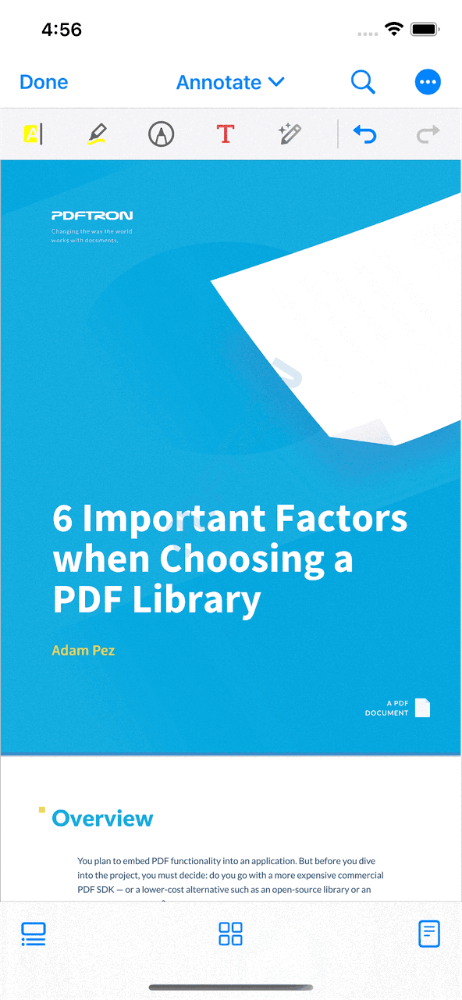

## About PDFTron Flutter
PDFTron's Flutter PDF library brings smooth, flexible and stand-alone document viewing and editing solutions using Flutter codebases for iOS and Android applications.

- Direct MS Office document viewing and conversion
- Fully customizable open source UI to improve app engagement
- Document reflow to increase readability and accessibility on mobile
- File streaming to view remote and complex documents faster
- Night mode to improve viewing in low-light environments
- And much more...

More information can be found at https://www.pdftron.com/documentation/guides/flutter

**Android**|**iOS**
:--:|:--:
|

## Contents

- [API](#API)
- [Prerequisites](#Prerequisites)
- [Legacy UI](#legacy-ui)
- [Installation](#Installation)
- [Usage](#Usage)
- [License](#License)

## API
APIs are available on the [API page](API.md).

## Prerequisites
- No license key is required for trial. However, a valid commercial license key is required after trial.
- PDFTron SDK >= 6.9.0
- Flutter >= 1.0.0

## Legacy UI

Version `0.0.6` is the last stable release for the legacy UI.

The release can be found here: https://github.com/PDFTron/pdftron-flutter/releases/tag/legacy-ui.

## Installation
### Android
1. First follow the Flutter getting started guides to [install](https://flutter.io/docs/get-started/install), [set up an editor](https://flutter.io/docs/get-started/editor), and [create a Flutter Project](https://flutter.io/docs/get-started/test-drive?tab=terminal#create-app). The rest of this guide assumes your project is created by running `flutter create myapp`.
2. Add the following dependency to your Flutter project in `myapp/pubspec.yaml`:
	```diff
	dependencies:
	   flutter:
	     sdk: flutter
	+  pdftron_flutter:
	+    git:
	+      url: git://github.com/PDFTron/pdftron-flutter.git
	+  permission_handler: '3.0.1'

	```
3. Now add the following items in your `myapp/android/app/build.gradle` file:
	```diff
	android {
	    compileSdkVersion 29

	    lintOptions {
		disable 'InvalidPackage'
	    }

	    defaultConfig {
		applicationId "com.example.myapp"
	-       minSdkVersion 16
	+       minSdkVersion 21
		targetSdkVersion 29
	+       multiDexEnabled true
	+       manifestPlaceholders = [pdftronLicenseKey:PDFTRON_LICENSE_KEY]
		versionCode flutterVersionCode.toInteger()
		versionName flutterVersionName
		testInstrumentationRunner "androidx.test.runner.AndroidJUnitRunner"
	    }
		...
	}
	```

4. In your `myapp/android/gradle.properties` file. Add the following line to it:
    ``` diff
    # Add the PDFTRON_LICENSE_KEY variable here. 
    # For trial purposes leave it blank.
    # For production add a valid commercial license key.
    PDFTRON_LICENSE_KEY=
    ```
    
5. In your `myapp/android/app/src/main/AndroidManifest.xml` file, add the following lines to the `<application>` tag:
	```diff
	...
	<application
		android:name="io.flutter.app.FlutterApplication"
		android:label="myapp"
		android:icon="@mipmap/ic_launcher"
	+	android:largeHeap="true"
	+	android:usesCleartextTraffic="true">
	
	    	<!-- Add license key in meta-data tag here. This should be inside the application tag. -->
	+	<meta-data
	+		android:name="pdftron_license_key"
	+		android:value="${pdftronLicenseKey}"/>
	...
	```
	
	Additionally, add the required permissions for your app in the `<manifest>` tag:
	```diff
		...
	+	<uses-permission android:name="android.permission.INTERNET" />
		<!-- Required to read and write documents from device storage -->
	+	<uses-permission android:name="android.permission.WRITE_EXTERNAL_STORAGE" />
		<!-- Required if you want to record audio annotations -->
	+	<uses-permission android:name="android.permission.RECORD_AUDIO" />
		...
	```

5a. If you are using the `DocumentView` widget, change the parent class of your `MainActivity` file (either Kotlin or Java) to `FlutterFragmentActivity`:
```
import androidx.annotation.NonNull
import io.flutter.embedding.android.FlutterFragmentActivity
import io.flutter.embedding.engine.FlutterEngine
import io.flutter.plugins.GeneratedPluginRegistrant

class MainActivity : FlutterFragmentActivity() {
    override fun configureFlutterEngine(@NonNull flutterEngine: FlutterEngine) {
        GeneratedPluginRegistrant.registerWith(flutterEngine);
    }
}
```

6. Replace `lib/main.dart` with what is shown [here](#usage)
7. Check that your Android device is running by running the command `flutter devices`. If none are available, follow the device set up instructions in the [Install](https://flutter.io/docs/get-started/install) guides for your platform.
8. Run the app with the command `flutter run`.
9. Please note that the widget version (`DocumentView`) contains existing issues such as none of the menu popup will work properly, see issue: https://github.com/flutter/flutter/issues/58273

### iOS

1. First, follow the official getting started guide on [installation](https://flutter.io/docs/get-started/install/macos), [setting up an editor](https://flutter.io/docs/get-started/editor), and [create a Flutter project](https://flutter.io/docs/get-started/test-drive?tab=terminal#create-app), the following steps will assume your app is created through `flutter create myapp`

2. Open `myapp` folder in a text editor. Then open `myapp/pubspec.yaml` file, add:
	```diff
	dependencies:
	   flutter:
	     sdk: flutter
	+  pdftron_flutter:
	+    git:
	+      url: git://github.com/PDFTron/pdftron-flutter.git
	+  permission_handler: '3.0.1'
	```

3. Run `flutter packages get`
4. Open `myapp/ios/Podfile`, add:
	```diff
	 # Uncomment this line to define a global platform for your project
	-# platform :ios, '9.0'
	+platform :ios, '10.0'
	...
	 target 'Runner' do
	   ...
	+  # PDFTron Pods
	+  use_frameworks!
	+  pod 'PDFNet', podspec: 'https://www.pdftron.com/downloads/ios/cocoapods/pdfnet/latest.podspec'
	 end
	```
6. Run `flutter build ios --no-codesign` to ensure integration process is successful
7. Replace `lib/main.dart` with what is shown [here](#usage)
8. Run `flutter emulators --launch apple_ios_simulator`
9. Run `flutter run`

## Usage

Open `lib/main.dart`, replace the entire file with the following:

```dart
import 'dart:async';
import 'dart:io' show Platform;

import 'package:flutter/material.dart';
import 'package:flutter/services.dart';
import 'package:pdftron_flutter/pdftron_flutter.dart';
import 'package:permission_handler/permission_handler.dart';

void main() => runApp(MyApp());

class MyApp extends StatelessWidget {
  @override
  Widget build(BuildContext context) {
    return MaterialApp(
      home: Viewer(),
    );
  }
}

class Viewer extends StatefulWidget {
  @override
  _ViewerState createState() => _ViewerState();
}

class _ViewerState extends State<Viewer> {
  String _version = 'Unknown';
  String _document =
      "https://pdftron.s3.amazonaws.com/downloads/pl/PDFTRON_mobile_about.pdf";
  bool _showViewer = true;

  @override
  void initState() {
    super.initState();
    initPlatformState();

    if (Platform.isIOS) {
      // Open the document for iOS, no need for permission
      showViewer();
    } else {
      // Request for permissions for android before opening document
      launchWithPermission();
    }
  }

  Future<void> launchWithPermission() async {
    Map<PermissionGroup, PermissionStatus> permissions =
        await PermissionHandler().requestPermissions([PermissionGroup.storage]);
    if (granted(permissions[PermissionGroup.storage])) {
      showViewer();
    }
  }

  bool granted(PermissionStatus status) {
    return status == PermissionStatus.granted;
  }

  // Platform messages are asynchronous, so we initialize in an async method.
  Future<void> initPlatformState() async {
    String version;
    // Platform messages may fail, so we use a try/catch PlatformException.
    try {
      PdftronFlutter.initialize("your_pdftron_license_key");
      version = await PdftronFlutter.version;
    } on PlatformException {
      version = 'Failed to get platform version.';
    }

    // If the widget was removed from the tree while the asynchronous platform
    // message was in flight, we want to discard the reply rather than calling
    // setState to update our non-existent appearance.
    if (!mounted) return;

    setState(() {
      _version = version;
    });
  }

  void showViewer() async {
    // opening without a config file will have all functionality enabled.
    // await PdftronFlutter.openDocument(_document);

    // shows how to disale functionality
//      var disabledElements = [Buttons.shareButton, Buttons.searchButton];
//      var disabledTools = [Tools.annotationCreateLine, Tools.annotationCreateRectangle];
    var config = Config();
//      config.disabledElements = disabledElements;
//      config.disabledTools = disabledTools;
//      config.multiTabEnabled = true;
//      config.customHeaders = {'headerName': 'headerValue'};

    var documentLoadedCancel = startDocumentLoadedListener((filePath) {
      print("document loaded: $filePath");
    });

    await PdftronFlutter.openDocument(_document, config: config);

    try {
      PdftronFlutter.importAnnotationCommand(
          "<?xml version=\"1.0\" encoding=\"UTF-8\"?>\n" +
              "    <xfdf xmlns=\"http://ns.adobe.com/xfdf/\" xml:space=\"preserve\">\n" +
              "      <add>\n" +
              "        <square style=\"solid\" width=\"5\" color=\"#E44234\" opacity=\"1\" creationdate=\"D:20200619203211Z\" flags=\"print\" date=\"D:20200619203211Z\" name=\"c684da06-12d2-4ccd-9361-0a1bf2e089e3\" page=\"1\" rect=\"113.312,277.056,235.43,350.173\" title=\"\" />\n" +
              "      </add>\n" +
              "      <modify />\n" +
              "      <delete />\n" +
              "      <pdf-info import-version=\"3\" version=\"2\" xmlns=\"http://www.pdftron.com/pdfinfo\" />\n" +
              "    </xfdf>");
    } on PlatformException catch (e) {
      print("Failed to importAnnotationCommand '${e.message}'.");
    }

    try {
      PdftronFlutter.importBookmarkJson('{"0":"Page 1"}');
    } on PlatformException catch (e) {
      print("Failed to importBookmarkJson '${e.message}'.");
    }

    var annotCancel = startExportAnnotationCommandListener((xfdfCommand) {
      // local annotation changed
      // upload XFDF command to server here
      print("flutter xfdfCommand: $xfdfCommand");
    });

    var bookmarkCancel = startExportBookmarkListener((bookmarkJson) {
      print("flutter bookmark: $bookmarkJson");
    });

    var path = await PdftronFlutter.saveDocument();
    print("flutter save: $path");

    // to cancel event:
    // annotCancel();
    // bookmarkCancel();
  }

  @override
  Widget build(BuildContext context) {
    return Scaffold(
      body: Container(
        width: double.infinity,
        height: double.infinity,
        child:
            // Uncomment this to use Widget version of the viewer
            // _showViewer
            // ? DocumentView(
            //     onCreated: _onDocumentViewCreated,
            //   ):
            Container(),
      ),
    );
  }

  void _onDocumentViewCreated(DocumentViewController controller) async {
    Config config = new Config();

    var leadingNavCancel = startLeadingNavButtonPressedListener(() {
      // Uncomment this to quit the viewer when leading navigation button is pressed
      // this.setState(() {
      //   _showViewer = !_showViewer;
      // });

      // Show a dialog when leading navigation button is pressed
      _showMyDialog();
    });

    controller.openDocument(_document, config: config);
  }

  Future<void> _showMyDialog() async {
    print('hello');
    return showDialog<void>(
      context: context,
      barrierDismissible: false, // user must tap button!
      builder: (BuildContext context) {
        return AlertDialog(
          title: Text('AlertDialog'),
          content: SingleChildScrollView(
            child: Text('Leading navigation button has been pressed.'),
          ),
          actions: <Widget>[
            TextButton(
              child: Text('OK'),
              onPressed: () {
                Navigator.of(context).pop();
              },
            ),
          ],
        );
      },
    );
  }
}
```

## Contributing
See [Contributing](./CONTRIBUTING.md)

## License
See [License](./LICENSE)

